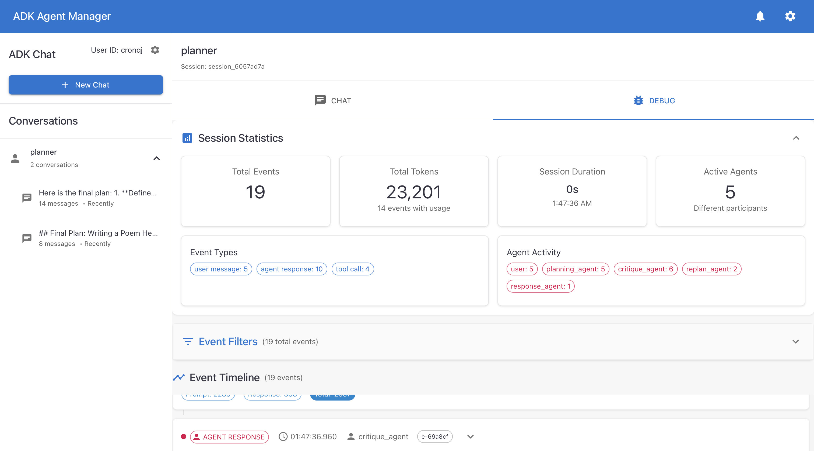

# ADK Frontend

A React TypeScript application for AI agent conversations with MCP (Model Context Protocol) integration.



## Features

- **Multi-Agent Conversations**: Chat with different AI agents and maintain separate conversation histories
- **MCP Integration**: Support for Model Context Protocol allowing agents to ask questions back to users
- **Session Routing**: Proper routing of MCP questions to their originating sessions
- **Real-time Communication**: WebSocket-based real-time messaging
- **Debug Views**: Comprehensive debugging interface for session events
- **Responsive Design**: Mobile-friendly interface with touch interactions
- **Accessibility**: WCAG compliant with comprehensive a11y support

## Key Components

### Chat Interface
- **ConversationView**: Main chat interface with tabbed chat/debug views
- **MessageInput**: User input with MCP question reply support
- **AgentSelector**: Switch between different AI agents
- **ConversationList**: History of conversations per agent

### MCP (Model Context Protocol)
- **MCPContext**: Manages question/answer flow between agents and users
- **Session Routing**: Ensures questions route to correct originating sessions
- **WebSocket Service**: Real-time communication with MCP server
- **Notification System**: User notifications for incoming agent questions

### State Management
- **AgentContext**: Global state for agents, conversations, and sessions
- **NotificationContext**: Manages MCP question notifications
- **Session Management**: Handles conversation persistence and routing

## Architecture

```
src/
├── components/          # React components
│   ├── layout/         # Layout components (Header, Sidebar)
│   └── debug/          # Debug view components
├── contexts/           # React contexts for state management
├── services/           # API and WebSocket services
├── utils/              # Utility functions
├── types/              # TypeScript type definitions
└── hooks/              # Custom React hooks
```

## Getting Started

### Prerequisites
- Node.js (v16 or higher)
- npm or yarn

### Installation
```bash
npm install
```

### Development
```bash
npm start
```

### Build
```bash
npm run build
```

### Testing
```bash
npm test
```

## Key Technologies

- **React 18** with TypeScript
- **Material-UI (MUI)** for components
- **WebSocket** for real-time communication
- **Jest & React Testing Library** for testing
- **React Router** for navigation

## Session Routing Fix

This application includes a critical fix for MCP question routing that ensures questions from agents are routed to their originating sessions rather than whatever session the user is currently viewing. This prevents cross-session contamination and ensures proper conversation flow.

## Contributing

This codebase follows React best practices with TypeScript. Key areas:

1. **Type Safety**: Comprehensive TypeScript types in `src/types/`
2. **Testing**: Unit and integration tests throughout
3. **Accessibility**: ARIA compliance and keyboard navigation
4. **Performance**: Virtualization for large conversation lists
5. **Error Handling**: Comprehensive error boundaries and validation

## License

[Your License Here]